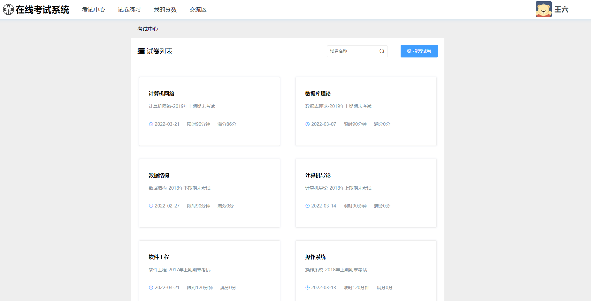
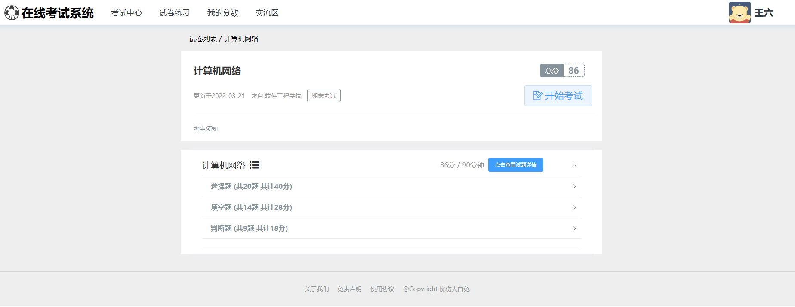
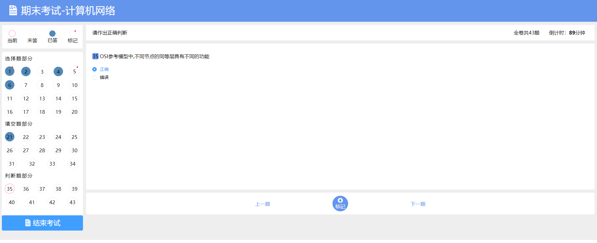
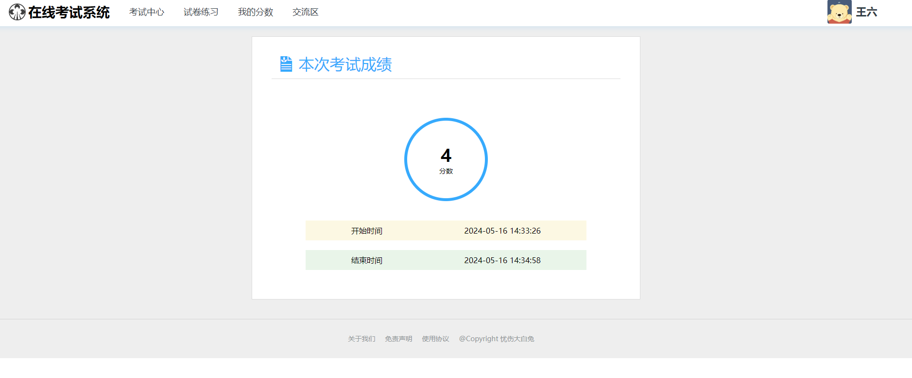
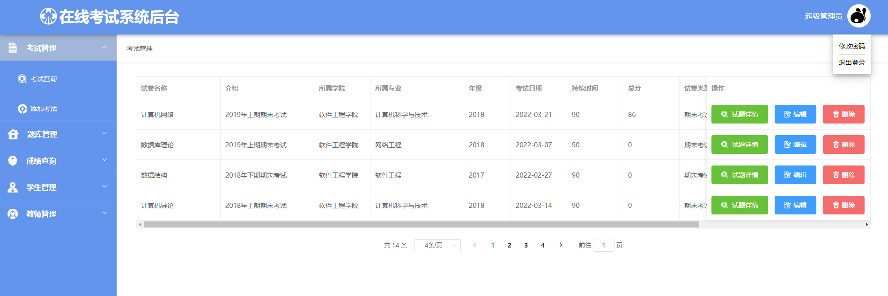
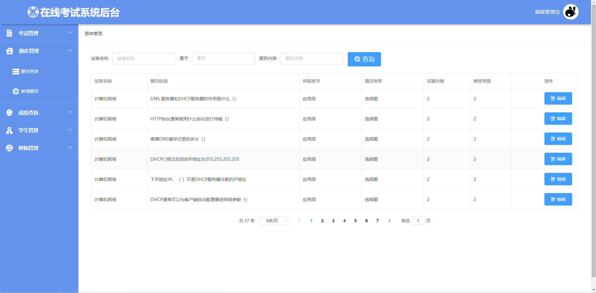

# OnlineExamSystem

## 介绍

在线考试系统, 前后端分离。

技术栈：
- 后端：SpringBoot+MyBatisPlus；
- 前端：Vue+ElementUI；

## 软件架构
软件架构说明。待补充

## 使用说明

1. 初始化数据库，执行db/online_exam.sql文件
2. 导入后端代码，配置数据库连接，运行
3. 导入前端代码，运行
4. 搭建完成，访问http://localhost:9202/

管理员初始化账号：9991/123456

## Todo
- [x] 后端组件升级，打安全补丁
- [ ] 表结构重新设计，升级RBAC模型进行角色、权限管理
- [ ] 前端重新设计，UI升级
- [ ] 简化页面，优化操作

## 界面截图
### 登录页面：

### 学生登录效果

### 教师或管理员登录效果

## 参与贡献

1.  Fork 本仓库
2.  新建 Feat_xxx 分支
3.  提交代码
4.  新建 Pull Request

## 鸣谢

忘记那里来的源码，改版了一下，感谢原作者。欢迎原作联系本人修改。